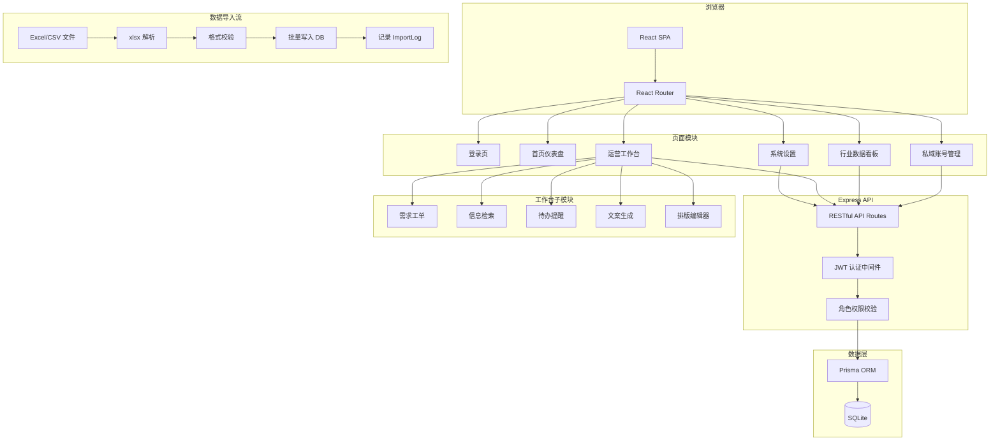
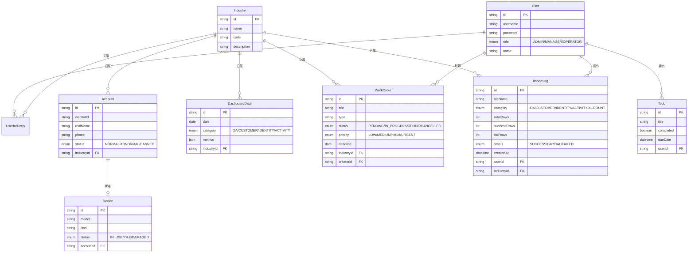

## 产品概述

搭建一个面向腾讯广告市场团队的「行业私域工作间」Web 管理平台，支持多行业灵活扩展，服务于运营负责人、市场经理、外包运营三种角色，统一管理私域账号资产、数据看板及日常运营工作流。

## 核心功能

### 一、私域账号管理

- 管理私域运营所用的设备信息（手机型号、IMEI、状态等）、手机号、微信号及实名认证信息
- 账号与行业的绑定关系，支持按行业筛选查看
- 账号状态追踪（正常/异常/封禁），支持批量导入导出

### 二、行业数据看板（离线导入模式）

- 所有数据通过 Excel/CSV 文件离线导入，不对接任何外部实时接口
- 运营团队定期导入公众号数据、客户数据、身份识别数据、活动数据
- 系统提供标准数据导入模板下载，导入时严格校验数据格式并给出错误提示
- 导入历史记录可追溯（导入时间、操作人、文件名、导入条数、状态）
- 按行业维度展示四类核心数据：公众号数据（粉丝、阅读、互动）、客户数据（总量、新增、活跃）、身份识别数据（已识别/未识别占比）、活动数据（参与人数、转化率）
- 支持时间范围选择与同环比对比，直观展示效果变化趋势
- 市场经理登录后仅可见自己负责行业的数据

### 三、运营工作台

- **需求工单**：运营人员在线提交需求（类型、行业、优先级、截止日期、附件），自动编号登记，支持状态流转（待处理/进行中/已完成/已取消）和筛选查看
- **信息检索**：按行业和关键词快速检索历史需求、客户资料、活动信息
- **工作提醒**：待办事项管理，支持设置截止时间，首页展示今日待办与临期提醒
- **工具集**：行业专属推广文案智能生成；公众号图文排版编辑器（富文本编辑，支持模板和样式预览）

### 四、系统基础

- 三种角色：管理员（运营负责人，全部权限）、市场经理（查看自己负责行业的数据看板）、运营人员（外包，使用工作台和账号管理）
- 行业灵活配置，可随时新增行业分类
- 用户与行业的多对多关联

## 技术选型

| 层级 | 技术 | 选型理由 |
| --- | --- | --- |
| 前端框架 | React 18 + Vite 5 + TypeScript 5 | 遵循 guidelines 要求使用 Vite 创建 React 项目 |
| UI 组件 | Tailwind CSS 3.4.17 + shadcn/ui | 高质量企业级组件，按需引入 |
| 路由 | React Router DOM v6 | 客户端路由，支持嵌套布局 |
| 图表 | Recharts | React 生态成熟图表库，支持响应式 |
| 富文本 | Tiptap | 可扩展编辑器，适合公众号排版 |
| 后端 | Express.js + TypeScript | 独立 API 服务，RESTful 接口 |
| 数据库 | SQLite + Prisma ORM | 轻量无依赖，内部团队完全够用 |
| 认证 | JWT (jsonwebtoken) | 简单用户名密码 + Token 鉴权 |
| 文件解析 | xlsx (SheetJS) | Excel/CSV 解析与生成，用于数据导入导出 |
| 图标 | lucide-react + react-icons | 遵循 guidelines 要求 |


## 实现方案

### 整体策略

采用前后端分离架构：Vite + React 前端 + Express API 后端，同仓管理。前端通过 React Router 实现 SPA 路由和嵌套布局，后端 Express 提供 RESTful API，Prisma 统一数据访问层。通过 JWT 中间件实现认证和基于角色的接口守卫，行业数据通过 industryId 外键实现多租户隔离。

### 关键技术决策

1. **离线数据导入方案**：数据看板的全部数据来源于 Excel 文件离线导入，不对接任何外部 API。提供四类标准模板（公众号/客户/身份识别/活动），导入时通过 xlsx 库解析文件内容，逐行校验字段格式（日期、数值范围、必填项），校验失败返回详细的行号+错误信息。每次导入记录 ImportLog（操作人、文件名、导入条数、成功/失败条数、时间戳），支持历史追溯。

2. **数据隔离方案**：所有业务数据表均包含 `industryId` 外键，查询时根据用户角色自动注入行业过滤条件。管理员可跨行业查看，市场经理和运营人员仅可访问其关联行业的数据。

3. **数据看板聚合**：导入的原始数据按日期粒度存储，看板查询时通过 Prisma 聚合函数按时间维度（日/周/月）计算指标。同环比通过两次时间窗口查询后前端计算差值和百分比。初期数据量小（每月几百到几千条），直接查询即可满足性能要求。

4. **工单状态机**：需求工单采用有限状态机模型（待处理 -> 进行中 -> 已完成/已取消），状态变更记录操作日志，支持按状态、行业、类型多维筛选。

5. **公众号排版编辑器**：基于 Tiptap 扩展，预置公众号常用样式模板（标题样式、引用框、分割线、图文混排），输出微信公众号兼容的 HTML，支持一键复制到公众号后台。

6. **文案生成**：预留 AI 文案生成接口，通过 prompt 模板结合行业属性生成推广文案，返回多个候选方案供运营选择编辑。

## 实现注意事项

- **权限控制**：Express 中间件层拦截路由校验 JWT，API 层二次校验角色和行业归属，防止越权访问
- **数据导入校验**：前端限制文件大小（10MB），后端流式解析避免大文件内存溢出，逐行校验并收集所有错误后统一返回
- **导入模板管理**：四类数据模板以静态 Excel 文件提供下载，模板内含表头说明和示例数据行
- **错误处理**：API 统一错误响应格式 `{ success, data, error }`，前端通过 toast 展示
- **向后兼容**：行业为独立实体表，新增行业仅需插入记录，无需修改代码

## 系统架构



## 数据模型核心关系



## 目录结构

```
行业私域工作间/
├── package.json                          # [NEW] 根 package.json，workspace 配置，统一管理前后端
├── client/                               # [NEW] 前端 Vite + React 项目
│   ├── package.json                      # [NEW] 前端依赖：react, react-router-dom, recharts, tiptap, xlsx, shadcn/ui, tailwindcss 等
│   ├── vite.config.ts                    # [NEW] Vite 配置，API 代理到后端，allowedHosts 设置
│   ├── tsconfig.json                     # [NEW] TypeScript 配置
│   ├── tsconfig.app.json                 # [NEW] App 级 TS 配置，verbatimModuleSyntax: false
│   ├── tailwind.config.ts                # [NEW] Tailwind 配置，集成 shadcn/ui 主题色
│   ├── postcss.config.js                 # [NEW] PostCSS 配置，tailwindcss + autoprefixer
│   ├── components.json                   # [NEW] shadcn/ui 配置文件
│   ├── index.html                        # [NEW] HTML 入口
│   ├── public/
│   │   └── templates/                    # [NEW] 数据导入模板文件目录
│   │       ├── 公众号数据导入模板.xlsx     # [NEW] 公众号数据导入模板，含表头说明和示例数据
│   │       ├── 客户数据导入模板.xlsx       # [NEW] 客户数据导入模板
│   │       ├── 身份识别数据导入模板.xlsx    # [NEW] 身份识别数据导入模板
│   │       └── 活动数据导入模板.xlsx       # [NEW] 活动数据导入模板
│   └── src/
│       ├── main.tsx                      # [NEW] 应用入口，挂载 Router 和全局 Provider
│       ├── App.tsx                       # [NEW] 根组件，定义路由表和布局嵌套
│       ├── index.css                     # [NEW] 全局样式，Tailwind 基础层 + shadcn CSS 变量
│       ├── lib/
│       │   ├── utils.ts                  # [NEW] 工具函数（cn 合并、日期格式化、同环比计算、工单编号生成）
│       │   ├── api.ts                    # [NEW] Axios 封装，统一请求拦截（JWT Token 注入）和响应处理
│       │   └── constants.ts              # [NEW] 常量定义（角色枚举、工单状态、工单类型、优先级、数据类别等）
│       ├── hooks/
│       │   ├── use-auth.ts               # [NEW] 认证 Hook，登录/登出/获取当前用户信息，JWT 管理
│       │   └── use-industry.ts           # [NEW] 行业选择状态管理 Hook，全局共享当前选中行业
│       ├── components/
│       │   ├── ui/                       # [NEW] shadcn/ui 基础组件目录（Button, Card, Dialog, Table, Select, Badge, Input, Tabs, Sheet 等）
│       │   ├── layout/
│       │   │   ├── app-layout.tsx        # [NEW] 全局布局组件，侧边栏 + 顶栏 + 内容区，包裹 Outlet
│       │   │   ├── sidebar.tsx           # [NEW] 侧边导航栏，根据角色动态渲染菜单，当前页高亮，折叠展开
│       │   │   ├── header.tsx            # [NEW] 顶部栏，行业切换下拉 + 通知铃铛 + 用户头像下拉
│       │   │   └── breadcrumb.tsx        # [NEW] 面包屑导航组件
│       │   ├── dashboard/
│       │   │   ├── stat-card.tsx         # [NEW] 指标卡片，展示数值、同环比箭头和百分比，hover 微放大
│       │   │   ├── trend-chart.tsx       # [NEW] 趋势折线图，基于 Recharts，支持多指标叠加
│       │   │   ├── pie-chart.tsx         # [NEW] 环形饼图，身份识别占比展示
│       │   │   ├── activity-list.tsx     # [NEW] 活动数据列表卡片，含转化率进度条
│       │   │   └── industry-filter.tsx   # [NEW] 行业筛选器 + 时间范围快捷按钮 + 日期选择器
│       │   ├── data-import/
│       │   │   ├── import-dialog.tsx     # [NEW] 数据导入弹窗，选择数据类别 + 行业 + 上传文件 + 校验反馈
│       │   │   ├── import-history.tsx    # [NEW] 导入历史记录列表，展示文件名/时间/条数/状态
│       │   │   └── template-download.tsx # [NEW] 模板下载组件，四类模板的下载卡片
│       │   ├── accounts/
│       │   │   ├── account-table.tsx     # [NEW] 账号列表表格，排序、分页、行内状态标签
│       │   │   └── account-form.tsx      # [NEW] 账号新建/编辑表单，设备信息、实名信息、行业选择
│       │   ├── workspace/
│       │   │   ├── order-card.tsx        # [NEW] 工单卡片，标题、状态徽标、优先级色条、行业标签
│       │   │   ├── order-form.tsx        # [NEW] 工单表单，类型/行业/优先级/描述
│       │   │   ├── todo-list.tsx         # [NEW] 待办列表，勾选完成、新增、删除、到期提醒
│       │   │   └── rich-editor.tsx       # [NEW] Tiptap 富文本编辑器封装，公众号样式工具栏、模板插入、HTML 输出
│       │   └── shared/
│       │       ├── data-table.tsx        # [NEW] 通用数据表格，封装排序、分页、筛选
│       │       ├── search-input.tsx      # [NEW] 防抖搜索输入框
│       │       └── empty-state.tsx       # [NEW] 空状态占位组件
│       └── pages/
│           ├── login.tsx                 # [NEW] 登录页面，用户名密码表单，品牌视觉
│           ├── home.tsx                  # [NEW] 首页仪表盘，今日待办、关键指标卡片、快捷入口
│           ├── accounts/
│           │   ├── index.tsx             # [NEW] 账号管理列表页，按行业/状态筛选、搜索、批量导入导出
│           │   ├── detail.tsx            # [NEW] 账号详情/编辑页，设备/微信实名/手机号/行业
│           │   └── create.tsx            # [NEW] 新建账号页面
│           ├── dashboard/
│           │   ├── index.tsx             # [NEW] 数据看板主页，行业选择 + 四大数据模块 + 时间对比
│           │   └── import.tsx            # [NEW] 数据导入管理页，上传入口 + 模板下载 + 导入历史
│           ├── workspace/
│           │   ├── index.tsx             # [NEW] 运营工作台首页，待办、近期工单、工具入口
│           │   ├── orders.tsx            # [NEW] 工单列表，看板/表格视图切换，多维筛选
│           │   ├── order-detail.tsx      # [NEW] 工单详情，状态流转、评论
│           │   ├── order-create.tsx      # [NEW] 新建工单
│           │   ├── editor.tsx            # [NEW] 公众号排版编辑器页面
│           │   └── copywriter.tsx        # [NEW] 推广文案生成页面
│           └── settings/
│               ├── index.tsx             # [NEW] 系统设置首页
│               ├── industries.tsx        # [NEW] 行业管理，新增/编辑/停用
│               └── users.tsx             # [NEW] 用户管理，分配角色和行业
├── server/                               # [NEW] 后端 Express API
│   ├── package.json                      # [NEW] 后端依赖：express, prisma, jsonwebtoken, xlsx, multer, cors 等
│   ├── tsconfig.json                     # [NEW] 后端 TypeScript 配置
│   ├── prisma/
│   │   ├── schema.prisma                 # [NEW] 全部数据模型定义：User, Industry, UserIndustry, Account, Device, DashboardData, ImportLog, WorkOrder, Todo
│   │   └── seed.ts                       # [NEW] 种子数据：管理员账号、默认行业（本地、3C数码、服饰、珠宝）、示例数据
│   └── src/
│       ├── index.ts                      # [NEW] Express 入口，注册中间件和路由，启动服务
│       ├── middleware/
│       │   ├── auth.ts                   # [NEW] JWT 认证中间件，解析 Token 并注入 req.user
│       │   └── role.ts                   # [NEW] 角色权限中间件，校验角色和行业归属
│       ├── routes/
│       │   ├── auth.ts                   # [NEW] 认证路由：登录/登出/获取当前用户
│       │   ├── accounts.ts               # [NEW] 账号 CRUD API + 批量导入（Excel 解析）+ 导出
│       │   ├── dashboard.ts              # [NEW] 数据看板 API，按行业+时间范围聚合查询
│       │   ├── import.ts                 # [NEW] 数据导入 API，文件上传+解析+校验+入库+记录 ImportLog
│       │   ├── orders.ts                 # [NEW] 工单 CRUD + 状态流转 API
│       │   ├── todos.ts                  # [NEW] 待办事项 CRUD API
│       │   ├── industries.ts             # [NEW] 行业管理 API
│       │   ├── users.ts                  # [NEW] 用户管理 API
│       │   └── copywriter.ts             # [NEW] 文案生成 API
│       ├── services/
│       │   ├── import.service.ts         # [NEW] 数据导入服务：Excel 解析、字段校验（日期/数值/必填）、批量写入、错误收集
│       │   ├── dashboard.service.ts      # [NEW] 看板数据聚合服务：按时间窗口查询、同环比计算
│       │   └── account.service.ts        # [NEW] 账号服务：CRUD + 批量导入解析 + 导出生成
│       ├── utils/
│       │   ├── response.ts               # [NEW] 统一响应格式 { success, data, error }
│       │   └── validators.ts             # [NEW] 数据校验工具（Excel 行校验规则、通用字段校验）
│       └── lib/
│           └── prisma.ts                 # [NEW] Prisma 客户端单例
```

## 关键数据结构

```typescript
// 数据导入相关类型定义

// 导入类别枚举
enum ImportCategory {
  OA = "OA",               // 公众号数据
  CUSTOMER = "CUSTOMER",   // 客户数据
  IDENTITY = "IDENTITY",   // 身份识别数据
  ACTIVITY = "ACTIVITY",   // 活动数据
  ACCOUNT = "ACCOUNT"      // 账号数据
}

// 导入结果响应
interface ImportResult {
  success: boolean;
  totalRows: number;
  successRows: number;
  failRows: number;
  errors: Array<{
    row: number;
    field: string;
    message: string;
  }>;
  importLogId: string;
}

// 看板聚合查询参数
interface DashboardQuery {
  industryId: string;
  category: ImportCategory;
  startDate: string;       // YYYY-MM-DD
  endDate: string;         // YYYY-MM-DD
  compareStartDate?: string; // 对比起始日期
  compareEndDate?: string;   // 对比结束日期
}
```

## 设计风格

采用企业级管理后台设计风格，以腾讯蓝为品牌主色调，整体界面简洁专业、信息层级清晰。使用经典的左侧固定导航 + 顶部信息栏 + 右侧内容区三栏布局，确保高效的操作动线。

卡片化设计承载各模块内容，辅以微交互动效（hover 微放大、状态切换过渡、按钮点击涟漪），让界面在专业感的基础上增添活力。数据看板区域使用渐变色指标卡片和平滑的图表动画，让数据一目了然。浅灰色背景搭配白色内容卡片，形成柔和的视觉层次。

## 页面规划

### 页面一：登录页

- **整体布局**：左右分栏，左侧为品牌展示区（深蓝渐变背景 + 半透明几何装饰 + 产品 Slogan），右侧为登录表单区
- **表单区域**：白色卡片居中，包含"行业私域工作间"标题、用户名输入框、密码输入框、"登录"主按钮，底部版权信息
- **视觉效果**：左侧背景从 #0052D9 到 #0034B5 渐变，右侧纯白，表单卡片带轻微阴影，输入框 focus 时边框变为品牌蓝

### 页面二：首页仪表盘

- **顶部导航栏**：左侧面包屑路径，右侧行业快捷切换下拉 + 通知铃铛 + 用户头像下拉菜单
- **概览卡片区**：四张指标卡片横排（管理账号数、本月新增客户、待处理工单、今日待办），每张含渐变色图标背景、大号数值、同比箭头和百分比，hover 时微上移 + 阴影加深
- **双栏内容区**：左侧今日待办列表（支持直接勾选完成），右侧近期工单动态时间线
- **快捷入口区**：底部四个图标卡片（录入数据、新建工单、文案生成、排版编辑器），hover 时图标上浮动效

### 页面三：数据看板

- **筛选工具栏**：行业选择下拉 + 时间范围快捷标签（近7天/近30天/近90天）+ 自定义日期范围 + "导入数据"按钮（打开导入弹窗）+ "下载模板"按钮
- **公众号数据区**：左侧四个小指标卡片（粉丝数/新增/阅读量/互动数），右侧 Recharts 折线趋势图，同比数据用灰色虚线叠加
- **客户数据区**：与公众号区结构一致，展示客户总量/新增/活跃
- **身份识别区**：左侧环形饼图（蓝绿双色），右侧具体数值和较上期对比百分比
- **活动数据区**：活动卡片列表，每张含活动名称、参与人数、转化率渐变进度条、对比标签

### 页面四：数据导入管理

- **模板下载区**：四张模板卡片横排（公众号/客户/身份识别/活动），每张含图标、模板名称、"下载模板"按钮
- **上传导入区**：选择数据类别下拉 + 选择行业下拉 + 拖拽上传区域（虚线框，支持点击选文件）+ "开始导入"按钮
- **校验反馈区**：导入中显示进度条，完成后展示结果卡片（成功/失败条数），失败时列出错误详情表格（行号、字段、错误原因）
- **导入历史区**：表格展示历史记录（时间、操作人、文件名、类别、行业、总条数、成功数、状态徽标）

### 页面五：运营工作台（含工单）

- **工单看板视图**：三列看板（待处理/进行中/已完成），卡片含标题、行业标签、优先级色条（紧急红/高橙/中蓝/低灰）、截止日期
- **视图切换**：右上角支持看板/表格视图切换，表格视图为完整数据表
- **新建工单**：右下角 FAB 按钮弹出表单弹窗
- **快捷工具区**：底部两张工具入口卡片（推广文案 + 排版编辑器），带图标和描述

### 页面六：公众号排版编辑器

- **工具栏区域**：顶部工具栏，字体/字号/加粗/斜体/对齐/颜色/插入图片/分割线，右侧"模板"按钮展开样式面板
- **编辑区域**：左侧 Tiptap 编辑区，宽度模拟手机屏幕（375px）居中；右侧可折叠的模板面板（标题样式、引用框、卡片样式预设）
- **操作栏**：底部固定栏，"手机预览"按钮（弹出手机模拟框）+ "复制 HTML"按钮 + "保存草稿"按钮

## Agent Extensions

### Skill

- **xlsx**
- 用途：账号管理模块的批量导入导出，以及数据看板的 Excel 数据离线导入功能。生成四类标准导入模板文件（公众号/客户/身份识别/活动数据模板），解析用户上传的 Excel 文件并校验格式
- 预期结果：生成带有表头说明和示例数据的 .xlsx 模板文件；实现 Excel 文件的上传解析、格式校验、错误反馈和数据入库全流程

- **kpi-dashboard-design**
- 用途：数据看板模块的指标体系设计，确定四大数据类别的核心指标选择、可视化图表类型和布局方案
- 预期结果：输出私域运营场景下合理的 KPI 指标框架和可视化最佳实践建议

### SubAgent

- **code-explorer**
- 用途：开发过程中探索已创建的项目结构，查找跨文件依赖和组件引用关系
- 预期结果：快速定位需要修改或引用的文件路径和导出接口