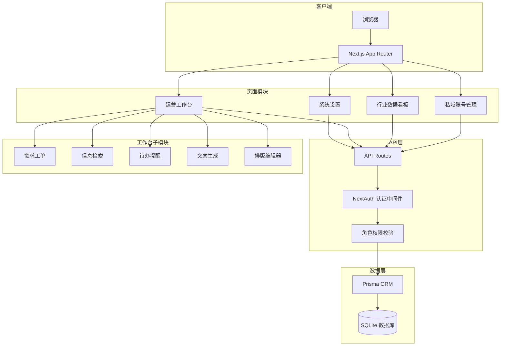
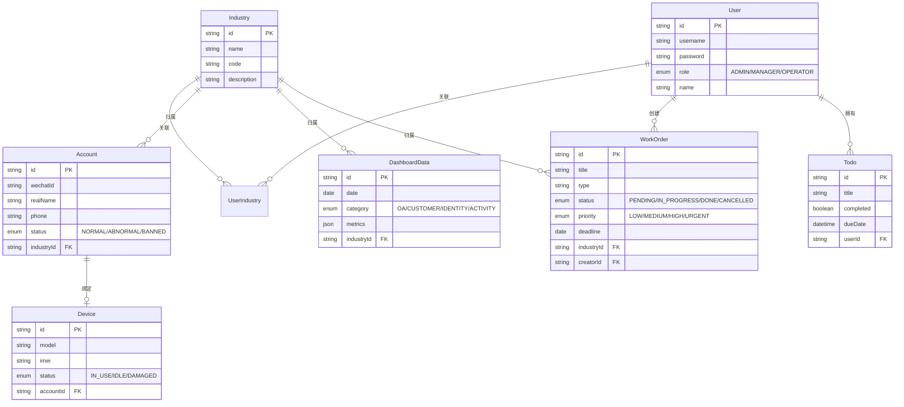

## 产品概述

搭建一个面向腾讯广告市场团队的「行业私域工作间」Web 管理平台，支持多行业灵活扩展，服务于运营负责人、市场经理、外包运营三种角色，统一管理私域账号资产、数据看板及日常运营工作流。

## 核心功能

### 一、私域账号管理

- 管理私域运营所用的设备信息（手机型号、IMEI、状态等）、手机号、微信号及实名认证信息
- 账号与行业的绑定关系，支持按行业筛选查看
- 账号状态追踪（正常/异常/封禁），支持批量导入导出

### 二、行业数据看板

- 按行业维度展示四类核心数据：公众号数据（粉丝、阅读、互动）、客户数据（总量、新增、活跃）、身份识别数据（已识别/未识别占比）、活动数据（参与人数、转化率）
- 支持时间范围选择与同环比对比，直观展示效果变化趋势
- 市场经理登录后仅可见自己负责行业的数据

### 三、运营工作台

- **需求工单**：运营人员在线提交需求（类型、行业、优先级、截止日期、附件），自动编号登记，支持状态流转（待处理/进行中/已完成）和筛选查看
- **信息检索**：按行业和关键词快速检索历史需求、客户资料、活动信息
- **工作提醒**：待办事项管理，支持设置截止时间，首页展示今日待办与临期提醒
- **工具集**：行业专属推广文案智能生成；公众号图文排版编辑器（富文本编辑，支持模板和样式预览）

### 四、系统基础

- 三种角色：管理员（运营负责人，全部权限）、市场经理（查看自己负责行业的数据看板）、运营人员（外包，使用工作台和账号管理）
- 行业灵活配置，可随时新增行业分类
- 用户与行业的多对多关联

## 技术选型

| 层级 | 技术 | 选型理由 |
| --- | --- | --- |
| 框架 | Next.js 14 (App Router) + TypeScript | 全栈一体，SSR/API Routes 统一部署 |
| UI | Tailwind CSS + shadcn/ui | 高质量组件，快速构建企业级界面 |
| 数据库 | SQLite + Prisma ORM | 轻量无依赖，内部10人团队完全够用 |
| 图表 | Recharts | React 生态成熟图表库，支持响应式 |
| 富文本 | Tiptap | 可扩展的富文本编辑器，适合公众号排版 |
| 认证 | NextAuth.js (Credentials) | 简单用户名密码 + JWT Session |
| 状态管理 | React Server Components + SWR | 减少客户端状态复杂度 |


## 实现方案

### 整体策略

采用 Next.js App Router 的全栈架构，前后端同仓，API Routes 提供 RESTful 接口，Prisma 统一数据访问层。通过中间件实现基于角色的路由守卫，行业数据通过 industryId 外键实现多租户隔离。

### 关键技术决策

1. **数据隔离方案**：所有业务数据表均包含 `industryId` 外键，查询时根据用户角色自动注入行业过滤条件。管理员可跨行业查看，市场经理和运营人员仅可访问其关联行业的数据。

2. **数据看板实现**：采用聚合查询 + 前端缓存策略。数据录入后通过 Prisma 的聚合函数按时间维度（日/周/月）计算指标，同环比通过两次时间窗口查询后前端计算差值和百分比。初期数据量小（<10万条），直接查询即可满足性能要求。

3. **工单状态机**：需求工单采用有限状态机模型（待处理 → 进行中 → 已完成/已取消），状态变更记录操作日志，支持按状态、行业、类型多维筛选。

4. **公众号排版编辑器**：基于 Tiptap 扩展，预置公众号常用样式模板（标题样式、引用框、分割线、图文混排），输出微信公众号兼容的 HTML，支持一键复制到公众号后台。

5. **文案生成**：预留 AI 文案生成接口，通过 prompt 模板结合行业属性生成推广文案，返回多个候选方案供运营选择编辑。

## 实现注意事项

- **权限控制**：中间件层拦截路由，API 层二次校验角色和行业归属，防止越权访问
- **数据导入导出**：账号管理支持 CSV 批量导入，使用流式解析避免大文件内存溢出
- **错误处理**：API 统一错误响应格式 `{ success, data, error }`，前端通过 toast 展示
- **向后兼容**：行业为独立实体表，新增行业仅需插入记录，无需修改代码

## 系统架构



## 数据模型核心关系



## 目录结构

```
行业私域工作间/
├── package.json                          # [NEW] 项目依赖配置，Next.js + Tailwind + Prisma + Recharts + Tiptap 等
├── next.config.js                        # [NEW] Next.js 配置，启用 App Router
├── tailwind.config.ts                    # [NEW] Tailwind 配置，集成 shadcn/ui 主题色和字体
├── tsconfig.json                         # [NEW] TypeScript 配置
├── .env                                  # [NEW] 环境变量（数据库路径、JWT密钥、NextAuth配置）
├── prisma/
│   ├── schema.prisma                     # [NEW] 数据模型定义，包含 User/Industry/Account/Device/DashboardData/WorkOrder/Todo 等全部模型及关联关系
│   └── seed.ts                           # [NEW] 种子数据，预置管理员账号、默认行业（本地、3C数码、服饰、珠宝）及示例数据
├── src/
│   ├── app/
│   │   ├── layout.tsx                    # [NEW] 根布局，包含全局导航侧边栏、顶部用户信息栏、主题 Provider
│   │   ├── page.tsx                      # [NEW] 首页仪表盘，展示今日待办概览、各行业关键指标卡片、快捷入口
│   │   ├── globals.css                   # [NEW] 全局样式，Tailwind 基础层 + shadcn/ui CSS 变量
│   │   ├── login/
│   │   │   └── page.tsx                  # [NEW] 登录页面，用户名密码表单，品牌视觉设计
│   │   ├── accounts/
│   │   │   ├── page.tsx                  # [NEW] 账号管理列表页，支持按行业/状态筛选、搜索、批量操作、导入导出
│   │   │   ├── [id]/
│   │   │   │   └── page.tsx              # [NEW] 账号详情/编辑页，展示设备信息、微信实名、手机号、关联行业
│   │   │   └── new/
│   │   │       └── page.tsx              # [NEW] 新建账号页面，设备绑定、行业选择表单
│   │   ├── dashboard/
│   │   │   └── page.tsx                  # [NEW] 数据看板页面，行业选择器 + 四大数据模块（公众号/客户/身份识别/活动）+ 时间范围选择 + 同环比趋势图
│   │   ├── workspace/
│   │   │   ├── page.tsx                  # [NEW] 运营工作台首页，展示待办事项、近期工单、快捷工具入口
│   │   │   ├── orders/
│   │   │   │   ├── page.tsx              # [NEW] 需求工单列表，按状态看板或表格视图展示，支持多维筛选
│   │   │   │   ├── [id]/
│   │   │   │   │   └── page.tsx          # [NEW] 工单详情页，状态流转操作、评论记录、附件查看
│   │   │   │   └── new/
│   │   │   │       └── page.tsx          # [NEW] 新建工单表单，行业/类型/优先级/截止日期/描述/附件
│   │   │   ├── editor/
│   │   │   │   └── page.tsx              # [NEW] 公众号排版编辑器页面，Tiptap 富文本编辑 + 样式模板面板 + HTML预览 + 一键复制
│   │   │   └── copywriter/
│   │   │       └── page.tsx              # [NEW] 推广文案生成页，选择行业和文案类型，输入关键词，生成多个候选文案
│   │   └── settings/
│   │       ├── page.tsx                  # [NEW] 系统设置首页，行业管理和用户管理入口
│   │       ├── industries/
│   │       │   └── page.tsx              # [NEW] 行业管理，新增/编辑/停用行业，配置行业属性
│   │       └── users/
│   │           └── page.tsx              # [NEW] 用户管理，新增/编辑用户，分配角色和行业
│   ├── api/
│   │   ├── auth/
│   │   │   └── [...nextauth]/
│   │   │       └── route.ts              # [NEW] NextAuth 认证路由，Credentials Provider + JWT 策略
│   │   ├── accounts/
│   │   │   └── route.ts                  # [NEW] 账号 CRUD API，支持批量导入（CSV解析）、按行业筛选
│   │   ├── dashboard/
│   │   │   └── route.ts                  # [NEW] 数据看板 API，按行业+时间范围聚合查询，返回指标数据及同环比
│   │   ├── orders/
│   │   │   └── route.ts                  # [NEW] 工单 CRUD + 状态流转 API，自动编号，操作日志记录
│   │   ├── todos/
│   │   │   └── route.ts                  # [NEW] 待办事项 CRUD API，支持标记完成、按到期时间排序
│   │   ├── industries/
│   │   │   └── route.ts                  # [NEW] 行业管理 API，CRUD 操作，仅管理员可用
│   │   ├── users/
│   │   │   └── route.ts                  # [NEW] 用户管理 API，CRUD + 行业关联，仅管理员可用
│   │   └── copywriter/
│   │       └── route.ts                  # [NEW] 文案生成 API，接收行业和关键词，返回文案候选
│   ├── components/
│   │   ├── ui/                           # [NEW] shadcn/ui 基础组件目录（Button, Card, Dialog, Table, Select, Badge 等）
│   │   ├── layout/
│   │   │   ├── sidebar.tsx               # [NEW] 侧边导航栏组件，根据角色动态渲染菜单项，当前页高亮
│   │   │   ├── header.tsx                # [NEW] 顶部栏组件，用户头像、行业切换器、通知铃铛
│   │   │   └── breadcrumb.tsx            # [NEW] 面包屑导航组件
│   │   ├── dashboard/
│   │   │   ├── stat-card.tsx             # [NEW] 指标卡片组件，展示数值、同环比变化箭头和百分比
│   │   │   ├── trend-chart.tsx           # [NEW] 趋势折线图组件，基于 Recharts，支持多指标叠加
│   │   │   ├── pie-chart.tsx             # [NEW] 饼图组件，用于身份识别占比展示
│   │   │   └── industry-filter.tsx       # [NEW] 行业筛选器组件，下拉选择行业 + 时间范围
│   │   ├── accounts/
│   │   │   ├── account-table.tsx         # [NEW] 账号列表表格组件，支持排序、分页、行内状态标签
│   │   │   └── account-form.tsx          # [NEW] 账号新建/编辑表单组件，设备信息、实名信息、行业选择
│   │   ├── workspace/
│   │   │   ├── order-card.tsx            # [NEW] 工单卡片组件，展示标题、状态徽标、优先级、行业标签
│   │   │   ├── order-form.tsx            # [NEW] 工单表单组件，类型/行业/优先级/描述/附件
│   │   │   ├── todo-list.tsx             # [NEW] 待办列表组件，支持勾选完成、新增、删除
│   │   │   └── rich-editor.tsx           # [NEW] Tiptap 富文本编辑器封装，预置公众号样式工具栏、模板插入、HTML输出
│   │   └── shared/
│   │       ├── data-table.tsx            # [NEW] 通用数据表格组件，封装排序、分页、筛选逻辑
│   │       ├── search-input.tsx          # [NEW] 搜索输入框组件，防抖搜索
│   │       └── empty-state.tsx           # [NEW] 空状态占位组件
│   ├── lib/
│   │   ├── prisma.ts                     # [NEW] Prisma 客户端单例，确保开发热重载不重复创建连接
│   │   ├── auth.ts                       # [NEW] NextAuth 配置，Credentials Provider、JWT 回调、Session 回调
│   │   ├── utils.ts                      # [NEW] 工具函数（日期格式化、同环比计算、CSV解析、工单编号生成）
│   │   └── constants.ts                  # [NEW] 常量定义（角色枚举、工单状态、工单类型、优先级等）
│   ├── hooks/
│   │   ├── use-current-user.ts           # [NEW] 获取当前登录用户信息及角色的 Hook
│   │   └── use-industry.ts              # [NEW] 行业选择状态管理 Hook，全局共享当前选中行业
│   └── middleware.ts                     # [NEW] Next.js 中间件，路由守卫：未登录重定向登录页，按角色限制路由访问
└── components.json                       # [NEW] shadcn/ui 配置文件
```

## 关键数据结构

```typescript
// prisma/schema.prisma 核心模型（简化）

enum Role {
  ADMIN       // 运营负责人 - 全部权限
  MANAGER     // 市场经理 - 查看关联行业数据看板
  OPERATOR    // 运营人员（外包） - 工作台 + 账号管理
}

enum OrderStatus {
  PENDING      // 待处理
  IN_PROGRESS  // 进行中
  DONE         // 已完成
  CANCELLED    // 已取消
}

enum AccountStatus {
  NORMAL       // 正常
  ABNORMAL     // 异常
  BANNED       // 封禁
}

// DashboardData.metrics JSON 结构
interface OfficialAccountMetrics {
  followers: number;       // 粉丝数
  newFollowers: number;    // 新增粉丝
  reads: number;           // 阅读量
  interactions: number;    // 互动数
}

interface CustomerMetrics {
  total: number;           // 客户总量
  newAdded: number;        // 新增
  active: number;          // 活跃数
}

interface IdentityMetrics {
  identified: number;      // 已识别
  unidentified: number;    // 未识别
}

interface ActivityMetrics {
  participants: number;    // 参与人数
  conversions: number;     // 转化数
  conversionRate: number;  // 转化率
}
```

## 设计风格

采用企业级管理后台风格，以清晰的信息层级和高效的操作动线为核心。整体风格简洁专业，配合腾讯蓝品牌色调，营造值得信赖的工具感。左侧固定导航 + 顶部信息栏 + 右侧内容区的经典三栏布局。

## 页面规划

### 页面一：登录页

- **顶部区域**：居中品牌 Logo + "行业私域工作间" 标题，下方副标题 "腾讯广告市场团队"
- **中部区域**：白色卡片登录表单，用户名输入框、密码输入框、登录按钮，背景为深蓝渐变配合半透明几何装饰
- **底部区域**：版权信息，简洁文字

### 页面二：首页仪表盘

- **顶部导航栏**：左侧面包屑路径，右侧行业快捷切换下拉 + 通知铃铛 + 用户头像下拉菜单
- **概览卡片区**：四张指标卡片横排（管理账号数、本月新增客户、待处理工单、今日待办），每张卡片含数值、同比变化箭头和百分比，悬浮时微放大动效
- **待办事项区**：左侧展示今日待办列表，支持直接勾选完成；右侧展示近期工单动态，点击可跳转详情
- **快捷入口区**：图标网格展示常用功能入口（录入数据、新建工单、文案生成、排版编辑器），hover 时图标上浮 + 阴影加深

### 页面三：数据看板

- **筛选工具栏**：行业选择下拉（支持"全部行业"选项）+ 时间范围快捷按钮（近7天/近30天/近90天）+ 自定义日期范围选择器
- **公众号数据区**：左侧四个小卡片展示粉丝数/新增粉丝/阅读量/互动数及同比变化，右侧趋势折线图展示选定时间范围内的日度趋势
- **客户数据区**：与公众号数据区结构一致，展示客户总量/新增/活跃指标及趋势
- **身份识别区**：左侧环形饼图展示已识别/未识别占比，右侧显示具体数值和较上期对比
- **活动数据区**：展示近期活动列表卡片，每张含活动名称、参与人数、转化率进度条、较上期对比标签

### 页面四：账号管理

- **操作工具栏**：搜索框 + 行业筛选下拉 + 状态筛选标签页（全部/正常/异常/封禁）+ "新增账号"和"批量导入"按钮
- **账号列表表格**：列包含微信号、实名、手机号、绑定设备、所属行业标签、状态徽标、操作按钮（编辑/详情），支持分页和排序
- **详情侧抽屉**：点击行展开右侧抽屉，完整展示账号信息、设备信息、操作历史
- **底部分页栏**：显示总数、当前页、每页条数选择

### 页面五：运营工作台

- **工单看板视图**：三列看板（待处理/进行中/已完成），每列下方工单卡片，卡片含标题、行业标签、优先级色条、截止日期、负责人头像，支持列表视图切换
- **新建工单浮窗**：右下角 FAB 按钮点击弹出表单弹窗，选择行业/类型/优先级，填写标题描述，上传附件
- **工具集区域**：底部工具快捷入口横排卡片——"推广文案"（带笔图标）和"排版编辑器"（带排版图标），点击进入对应子页面
- **搜索区域**：顶部搜索框，支持全局搜索工单、客户信息、历史记录

### 页面六：公众号排版编辑器

- **工具栏区域**：顶部工具栏含字体、字号、加粗斜体、对齐、插入图片、插入分割线、文字颜色等按钮，右侧"模板"按钮打开预设样式面板
- **编辑区域**：左侧为 Tiptap 富文本编辑区，所见即所得，宽度模拟手机屏幕宽度；右侧为模板/样式面板（标题样式、引用框、卡片样式等）
- **预览与操作区**：底部工具栏含"预览"（弹出手机模拟框预览）、"复制 HTML"（一键复制适配微信公众号的 HTML）、"保存草稿"按钮
- **行业选择区**：顶部行业标签选择，加载该行业的历史模板和素材

## 使用的扩展

### Skill

- **xlsx**
- 用途：账号管理模块的批量导入导出功能，处理 CSV/Excel 格式的账号数据文件
- 预期结果：支持用户上传包含设备、手机号、微信信息的 Excel 文件并解析入库，同时支持导出当前账号列表为 Excel

- **business-intelligence**
- 用途：数据看板模块的指标体系设计和可视化方案优化
- 预期结果：帮助设计合理的 KPI 指标框架，优化数据看板的图表类型选择和布局

- **kpi-dashboard-design**
- 用途：数据看板的指标选择、可视化最佳实践和实时监控模式设计
- 预期结果：输出合理的看板指标层级和可视化方案建议

### SubAgent

- **code-explorer**
- 用途：开发过程中探索项目结构、查找跨文件依赖关系
- 预期结果：快速定位需要修改的文件和依赖链路